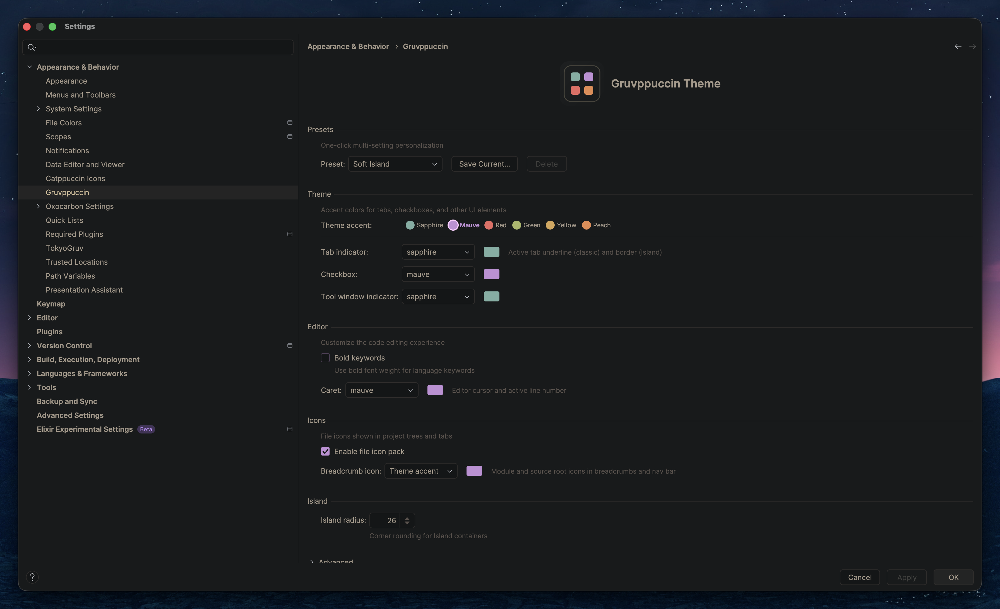

# Gruvppuccin Theme for IntelliJ

> Warm, ergonomic color themes blending Gruvbox, Catppuccin, and Embark palettes.

33 theme variants with runtime-customizable accent colors, Island UI support, and a built-in file icon pack.


## Install

**From JetBrains Marketplace:**

1. Open **Settings → Plugins → Marketplace**
2. Search for **Gruvppuccin Theme**
3. Click **Install** and restart the IDE
4. Go to **Settings → Appearance & Behavior → Appearance** and select a Gruvppuccin theme

## Theme Families

### Gruvppuccin (Gruvbox x Catppuccin)

| Variant | Style |
|---------|-------|
| Macchiato | Deeper dark — low-light environments, OLED screens |
| Mocha | Classic dark — standard dark mode |
| Latte | Warm light — daylight, light mode preference |

### Gruvbark (Gruvbox x Embark)

| Variant | Blend |
|---------|-------|
| Nebula | 70% Embark, 30% Gruvbox |
| Void | 50% Embark, 50% Gruvbox |
| Nova | 30% Embark, 70% Gruvbox |
| Haze | 60% Embark, 40% Gruvbox |

### Gruvppuccin Embark

| Variant | Blend |
|---------|-------|
| Nebula | 70% Embark, 30% Gruvppuccin |
| Void | 50% Embark, 50% Gruvppuccin |
| Nova | 30% Embark, 70% Gruvppuccin |
| Haze | 60% Embark, 40% Gruvppuccin |

Each theme ships in three UI styles: **Classic**, **Island** (rounded floating panels for JetBrains Island UI 2025.2+), and **Soft Island** (gentler sidebar contrast).


## Island UI


## Customization

Configure under **Settings → Appearance → Gruvppuccin**. Changes apply instantly.

- **Accent colors** — sapphire, mauve, red, green, yellow, peach, with per-element overrides
- **Compact mode** — tighter tree and table row padding
- **Bold keywords** — heavier weight for language keywords
- **Corner radius** — adjustable rounding for UI components
- **File icon pack** — 28 file types with dark/light variants



## Color Palette

Syntax highlighting follows the Catppuccin role mapping with Gruvbox-inspired colors:

| Role | Dark Variants | Light Variant |
|------|--------------|---------------|
| Keywords | `#c28fd6` mauve | `#8f3f71` |
| Strings | `#a9b665` green | `#79740e` |
| Functions | `#7daea3` sapphire | `#076678` |
| Types | `#d8a657` yellow | `#b57614` |
| Numbers | `#e78a4e` peach | `#d65d0e` |
| Comments | `#6e655a` overlay1 | `#928374` |
| Operators | `#8dbcb0` sky | `#458588` |
| Parameters | `#e07868` maroon | `#9d0006` |
| Fields | `#afa4cc` lavender | `#7c5c8f` |

## IdeaVim Mode Widget

The IdeaVim mode indicator uses its own color system outside the IntelliJ theme. Add one of the configs below to your `~/.ideavimrc` for proper contrast.

### Gruvppuccin variants

For **Macchiato**, **Mocha**, **Latte**, and all **Gruvppuccin Embark** variants:

```vim
" IdeaVim Mode Widget — Gruvppuccin
let g:widget_mode_is_full_customization_dark = 1
let g:widget_mode_normal_background_dark = "#a9b665"
let g:widget_mode_normal_foreground_dark = "#141617"
let g:widget_mode_insert_background_dark = "#d8a657"
let g:widget_mode_insert_foreground_dark = "#141617"
let g:widget_mode_replace_background_dark = "#ea6962"
let g:widget_mode_replace_foreground_dark = "#141617"
let g:widget_mode_visual_background_dark = "#c28fd6"
let g:widget_mode_visual_foreground_dark = "#141617"
let g:widget_mode_command_background_dark = "#7daea3"
let g:widget_mode_command_foreground_dark = "#141617"
let g:widget_mode_select_background_dark = "#e78a4e"
let g:widget_mode_select_foreground_dark = "#141617"

let g:widget_mode_is_full_customization_light = 1
let g:widget_mode_normal_background_light = "#79740e"
let g:widget_mode_normal_foreground_light = "#f2e5bc"
let g:widget_mode_insert_background_light = "#b57614"
let g:widget_mode_insert_foreground_light = "#f2e5bc"
let g:widget_mode_replace_background_light = "#cc241d"
let g:widget_mode_replace_foreground_light = "#f2e5bc"
let g:widget_mode_visual_background_light = "#8f3f71"
let g:widget_mode_visual_foreground_light = "#f2e5bc"
let g:widget_mode_command_background_light = "#076678"
let g:widget_mode_command_foreground_light = "#f2e5bc"
let g:widget_mode_select_background_light = "#d65d0e"
let g:widget_mode_select_foreground_light = "#f2e5bc"
```

### Gruvbark variants

For **Gruvbark Nebula**, **Void**, **Nova**, and **Haze**:

```vim
" IdeaVim Mode Widget — Gruvbark
let g:widget_mode_is_full_customization_dark = 1
let g:widget_mode_normal_background_dark = "#b8bb26"
let g:widget_mode_normal_foreground_dark = "#141617"
let g:widget_mode_insert_background_dark = "#fabd2f"
let g:widget_mode_insert_foreground_dark = "#141617"
let g:widget_mode_replace_background_dark = "#fb4934"
let g:widget_mode_replace_foreground_dark = "#141617"
let g:widget_mode_visual_background_dark = "#d3869b"
let g:widget_mode_visual_foreground_dark = "#141617"
let g:widget_mode_command_background_dark = "#83a598"
let g:widget_mode_command_foreground_dark = "#141617"
let g:widget_mode_select_background_dark = "#fe8019"
let g:widget_mode_select_foreground_dark = "#141617"

let g:widget_mode_is_full_customization_light = 1
let g:widget_mode_normal_background_light = "#98971a"
let g:widget_mode_normal_foreground_light = "#f2e5bc"
let g:widget_mode_insert_background_light = "#d79921"
let g:widget_mode_insert_foreground_light = "#f2e5bc"
let g:widget_mode_replace_background_light = "#cc241d"
let g:widget_mode_replace_foreground_light = "#f2e5bc"
let g:widget_mode_visual_background_light = "#b16286"
let g:widget_mode_visual_foreground_light = "#f2e5bc"
let g:widget_mode_command_background_light = "#458588"
let g:widget_mode_command_foreground_light = "#f2e5bc"
let g:widget_mode_select_background_light = "#d65d0e"
let g:widget_mode_select_foreground_light = "#f2e5bc"
```

> Both configs include dark and light keys so switching between theme variants works seamlessly. Island and Soft Island variants use the same accents as their classic counterparts.

## Compatibility

IntelliJ IDEA 2022.3 – 2026.1 (Community or Ultimate). Syntax highlighting covers 30+ languages.

## Issues

Found a bug or have a feature request? [Open an issue](https://github.com/sandboxws/gruvppuccin-intellij-theme/issues).

## License

Gruvppuccin Theme is proprietary software. A 30-day free trial is available. See [EULA](EULA.md) for full terms.
